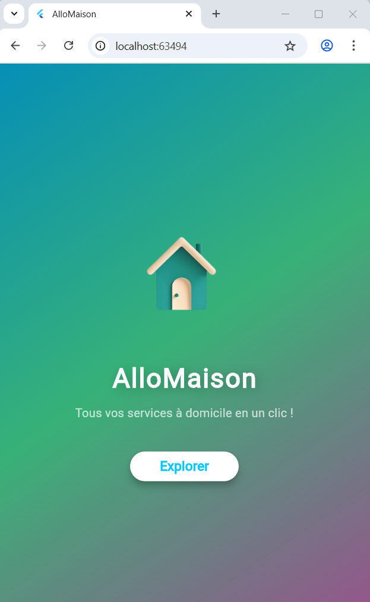
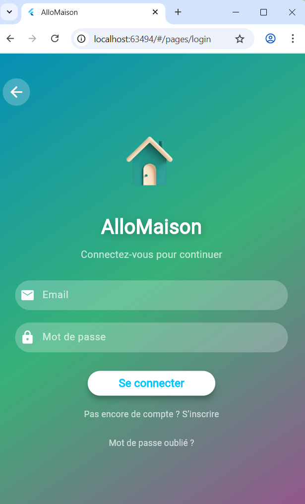
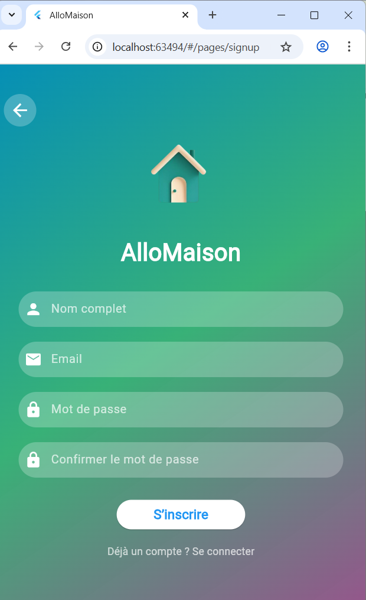
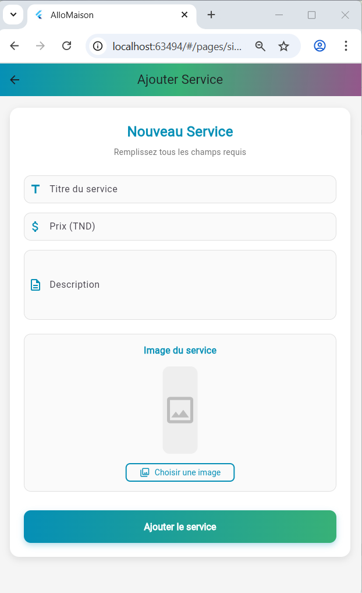
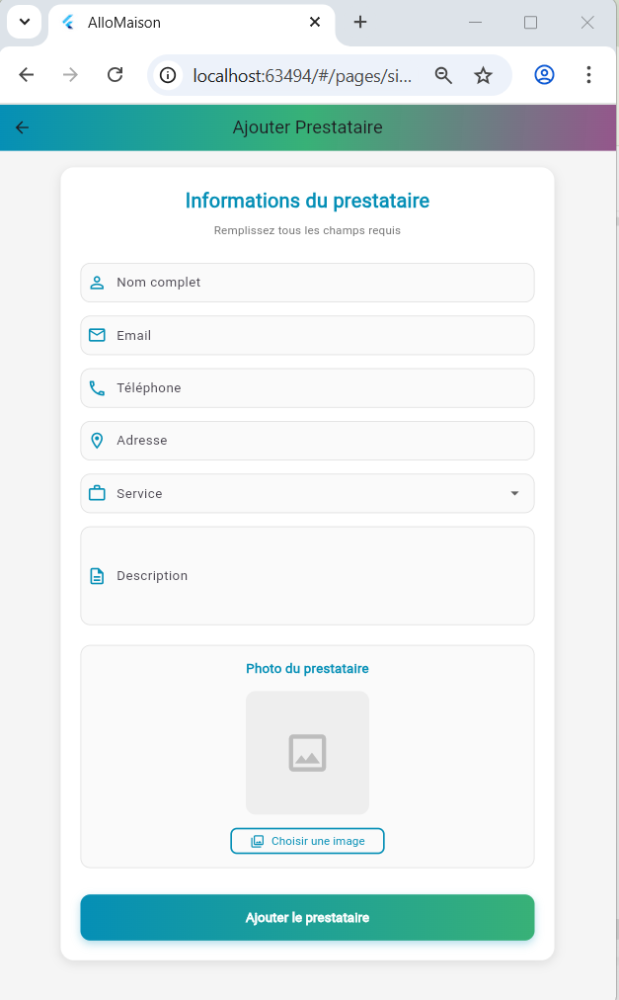
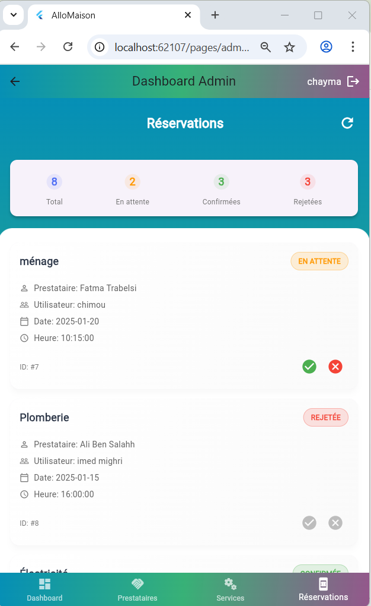

# 🏠 AlloMaison — Application de Services à Domicile

AlloMaison est Ma premiére application mobile.elle est développée avec **Flutter** permettant aux utilisateurs de **réserver des services à domicile** tels que : plomberie, électricité, ménage, peinture, jardinage, babysitting et bien plus.

Elle inclut un système complet côté **administration** et côté **client**, avec gestion des prestataires, des réservations, des services, et une connexion au backend PHP/MySQL.

---

## 🚀 Fonctionnalités principales

### 👤 Côté Utilisateur (Client)
- Parcourir les services disponibles  
- Afficher les détails d’un service (images + description + prix + prestataire)  
- Réserver un service en ligne  
- Voir l’historique des réservations   
- Recevoir le statut des réservations (en attente, confirmé, refusé...)

---

### 🧑‍🔧 Côté Prestataire / Admin
- Gestion des prestataires (CRUD)  
- Ajouter / modifier / supprimer un service   
- Gestion des réservations (confirmé / rejeté)   
- Dashboard avec statistiques

---

## 🛠️ Technologies utilisées

### 📱 **Frontend (Mobile)**
- **Flutter 3.x**
- **Dart**
- **Material Design**
- **HTTP Package** pour la communication API
- **Stateful Widgets** /  **Stateless Widgets** / **FutureBuilder**
- **Image.network** et image upload

### 🌐 **Backend**
- **PHP 8**
- **MySQL**
- Endpoints REST :  
  - `get_reservations.php`  
  - `add_prestataire.php`  
  - `edit_service.php`  
  - `update_reservation_status.php`  
  - etc.

### 🗄️ Base de données
- MySQL avec tables :
  - `users`
  - `prestataires`
  - `services`
  - `reservations`
---

## 📸 Captures d’écran (Screenshots)

Voici quelques captures de l’application :

### 🏠 Page d’accueil

### 🏠 page de connexion

### 🏠page d'inscription
 

### 🏠 Dashboard Admin

### 🏠 page ajouter service

### 🏠 page ajouter service

### 📅 Liste des réservations

